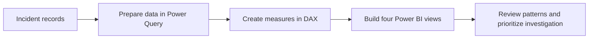

# HSE Risk Intelligence System: Construction Safety Analytics Dashboard

An interactive four-page Power BI dashboard that turns **4,847 construction safety incident records** into an executive overview of incident severity, risk, hazards, injuries, and reported contributing factors. The project demonstrates how business intelligence can help safety teams explore patterns and decide where further investigation may be useful.

> **Scope:** The dashboard describes patterns in the supplied incident data. It does not prove that a factor caused an incident or that a recommended action will reduce incidents.

## Business problem

Construction safety teams need to understand more than the total number of incidents. They need to see how incidents relate to severity, hazard type, injury location, timing, and recorded root-cause factors. Without a consolidated analytical view, it can be harder for managers to identify recurring patterns and direct investigations or preventive reviews.

This project addresses the need for a single, interactive view of safety performance that helps managers ask:

- What is the recorded incident volume and severity?
- Which incident types and hazard groups appear most often or have the highest risk scores?
- When do incidents occur more frequently?
- Which body parts are most often recorded as injured?
- Which records or categories need further investigation or data-quality review?

## Solution

I developed a Power BI dashboard that organises the incident data into four connected views: Executive Overview, Risk & Safety Analysis, Incident Analysis, and Root Cause & Investigation. Power Query supports data preparation, while DAX measures present key indicators for management review.

The dashboard is designed to help users move from an overall safety snapshot to more detailed questions about hazards, injuries, and contributing factors. The findings can inform investigation priorities and preventive reviews; they should be validated with site-level evidence and HSE expertise before operational decisions are made.

## Project at a glance

| Item | Description |
| --- | --- |
| Domain | Construction health, safety, and environment (HSE) |
| Records analysed | 4,847 workplace incidents |
| Primary technology | Microsoft Power BI |
| Data preparation | Power Query |
| Measures and KPIs | DAX |
| Dashboard pages | 4 |
| Intended users | Safety managers, HSE officers, site leaders, and operational decision-makers |

## Analytics workflow

## Dashboard findings and business relevance

### 1. Executive Overview

- **Summarised 4,847 incident records in Power BI** using four headline indicators: **2,964 fatal cases**, **486 high-risk incidents**, and an **average risk score of 3.02**, alongside total incidents. This gives managers a concise view of recorded volume and severity.
- **Compared incident types and monthly counts** to highlight Struck By, Other, and Vehicle incidents among the leading types, and March, February, and January among the months with higher counts. This can guide follow-up reviews of event patterns and work activity.

### 2. Risk & Safety Analysis

- **Segmented incident risk scores in Power BI** across the reported 0–10 range and ranked hazard groups. Chemical / Fire Hazards recorded the highest risk contribution, followed by Work at Height, Vehicle Hazards, and Machine Hazards; this helps focus further hazard-control reviews.
- **Grouped dangerous-event keywords** including Struck By, Struck Against, Crushing, Structural Collapse, and Tree Trimming. These categories provide a starting point for checking controls such as exclusion zones, equipment safeguards, and site procedures.

### 3. Incident Analysis

- **Analysed injury records by body part** and found Head (35.22%), Whole Body (19.10%), Finger (18.93%), Internal Injuries (13.87%), and Heart (12.80%) among the reported categories. The head-injury share supports reviewing PPE fit, availability, and compliance; the dashboard alone does not establish PPE as the cause.
- **Compared incident counts by month and project**: March recorded the highest count and June the lowest on this dashboard page. A notable number of incidents were assigned to “Unknown Project (0),” indicating a data-quality issue for project-level reporting.

### 4. Root Cause & Investigation

- **Organised reported contributing factors** into human and environmental categories, including Misjudgement, Safety Devices Removed, Work Surface, Shear Point Action, Weather, and Temperature. This helps investigators examine patterns in recorded factors alongside incident evidence.
- **Compared annual average risk scores by hazard group** and surfaced the highest listed combinations: Chemical / Fire Hazard in 2017 (9.07), Chemical / Fire Hazard in 2016 (9.06), and Vehicle Hazard in 2017 (9.00). These scores help identify cases for review; they do not by themselves establish a cause.

## Recommended business actions

The dashboard supports prioritisation and discussion. Based on the patterns shown, HSE teams could:

- Review struck-by and struck-against incidents, including site traffic, exclusion zones, and work sequencing.
- Investigate Chemical / Fire Hazard cases with high risk scores and verify whether controls are appropriate and consistently applied.
- Review head-injury cases alongside task-specific PPE assessments and site observations.
- Check the “Unknown Project (0)” records and strengthen project-field completion and reporting validation.
- Compare incident counts with exposure data, such as hours worked, workforce size, and project activity, before drawing conclusions about relative risk.

These are recommendations for investigation. The dashboard does not measure the effect of implementing them.

## Tools and skills demonstrated

- **Microsoft Power BI:** interactive dashboard design and data storytelling
- **Power Query:** data cleaning, transformation, and ETL
- **DAX:** KPI and analytical measure development
- **Business analysis:** incident segmentation, trend analysis, risk review, and communicating findings for decision support

## Data interpretation note

The dataset contains **2,964 fatal cases out of 4,847 records**, an unusually high share for many incident datasets. The definition of “fatal,” source coding, and dataset scope should be validated before using the dashboard for operational decisions. Incident frequency is not normalised by hours worked, workforce size, or project exposure, and recorded associations do not prove causation.

## Author

**Norazlina Mohd Shariff**  
Data Science Student | Aspiring Data Analyst
